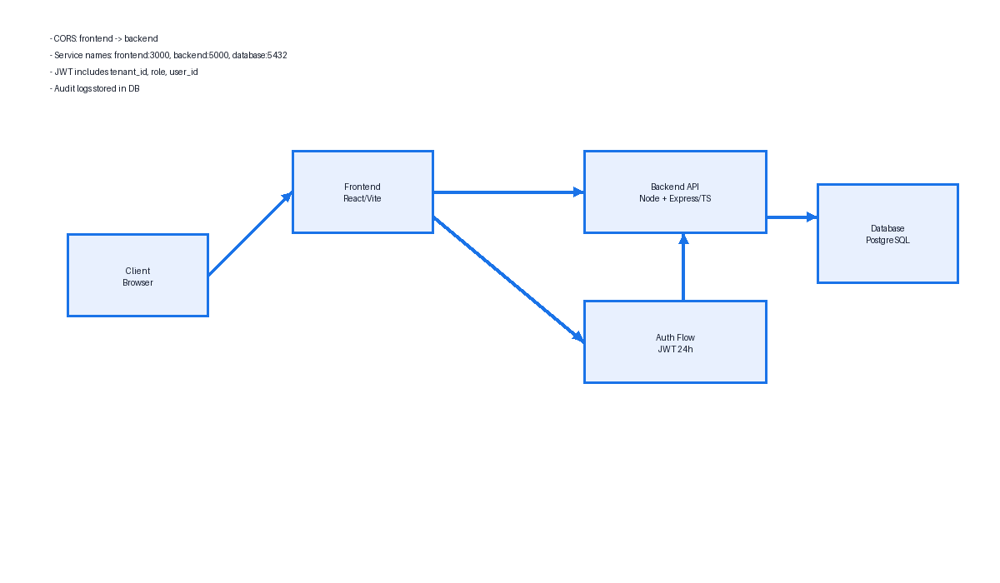
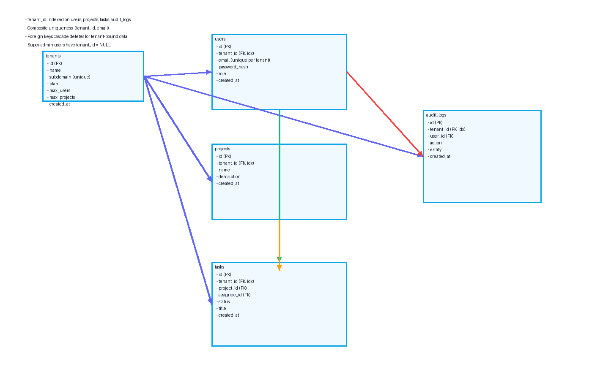

# Architecture

## System Architecture Diagram

- Browser calls the React/Vite frontend (service `frontend:3000`).
- Frontend communicates with backend (`backend:5000`) over CORS, sending JWT in Authorization header (or secure cookie) containing `tenant_id`, `user_id`, `role`.
- Backend (Node + Express/TypeScript) handles auth, RBAC, validation, and tenant scoping. It logs to `audit_logs` with tenant_id context.
- Backend persists to PostgreSQL (`database:5432`) with `tenant_id` on all tenant-bound tables. Health checks surface DB connectivity.
- Internal service discovery uses Docker service names; no localhost assumptions inside the compose network.

## Database Schema Design

Key points:
- All tenant-bound tables include `tenant_id` and index it for isolation and performance.
- `users.email` is unique per tenant via `(tenant_id, email)` composite uniqueness. Super admins have `tenant_id = NULL`.
- Foreign keys cascade deletes for tenant-owned data: tenants -> users/projects/tasks/audit_logs; projects -> tasks; users -> tasks (assignee) and audit_logs.
- Core tables: tenants, users, projects, tasks, audit_logs (sessions optional). Tasks include status and assignments within tenant scope.

## API Architecture

### Auth
- POST /api/auth/register-tenant — public; creates tenant + tenant_admin; enforces unique subdomain.
- POST /api/auth/login — public; issues JWT (24h).
- POST /api/auth/logout — auth required; invalidates client token (stateless client clear).
- GET /api/health — public; returns service/db status.

### Tenants
- GET /api/tenants — auth required; role: super_admin; list tenants.
- GET /api/tenants/:id — auth required; roles: super_admin or tenant_admin of same tenant.
- PATCH /api/tenants/:id/plan — auth required; role: tenant_admin; upgrades/downgrades plan (free/pro/enterprise) with limit checks.
- GET /api/tenants/:id/usage — auth required; role: tenant_admin; returns current counts vs plan limits.

### Users
- POST /api/users — auth required; role: tenant_admin; invite/create user (enforces `(tenant_id, email)` uniqueness and plan max_users).
- GET /api/users — auth required; roles: tenant_admin, super_admin (scoped); list users in tenant.
- GET /api/users/me — auth required; any role; returns profile and tenant context.
- PATCH /api/users/:id — auth required; role: tenant_admin; update role/status for a user in tenant.
- DELETE /api/users/:id — auth required; role: tenant_admin; remove user (cascades assigned tasks per policy or reassign).

### Projects
- POST /api/projects — auth required; roles: tenant_admin, user; creates project (enforces plan max_projects).
- GET /api/projects — auth required; roles: tenant_admin, user; list projects in tenant.
- GET /api/projects/:id — auth required; roles: tenant_admin, user; fetch project details.
- PATCH /api/projects/:id — auth required; roles: tenant_admin, user (if permitted); update project.
- DELETE /api/projects/:id — auth required; role: tenant_admin; delete project and cascade tasks.

### Tasks
- POST /api/projects/:projectId/tasks — auth required; roles: tenant_admin, user; create task under project (tenant-scoped, assignee in tenant).
- GET /api/projects/:projectId/tasks — auth required; roles: tenant_admin, user; list tasks for project.
- GET /api/tasks/:id — auth required; roles: tenant_admin, user; fetch task (same tenant guard).
- PATCH /api/tasks/:id — auth required; roles: tenant_admin, user (if assignee or permitted); update status/title/assignee.
- DELETE /api/tasks/:id — auth required; role: tenant_admin; delete task.

### Audit Logs
- GET /api/audit-logs — auth required; roles: tenant_admin (tenant-scoped) or super_admin (cross-tenant); list critical actions.
